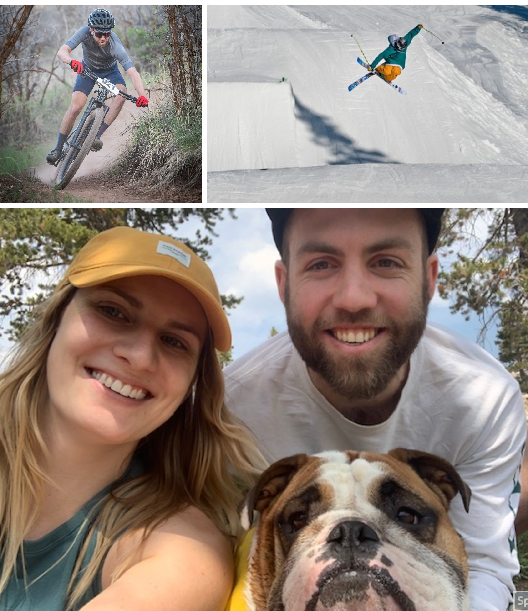

::: {.floatting}
```{r out.width='60%', out.extra='style="float:left; padding:12px"',echo=FALSE}

```

I was born in New England, but grew up in Salt Lake City, Utah. I spent most of my childhood dreaming of being a professional skier until I discovered my interests in statistics and biomedical research. I still value being active and spend my free time cycling and running. Over the past few years, I have had the privilege of racing some of the West's great endurance cross-country mountain bike and gravel races. My wife is a MD student at the University of Utah and we are both looking forward to graduating in Spring 2022 and starting our next chapter!

:::